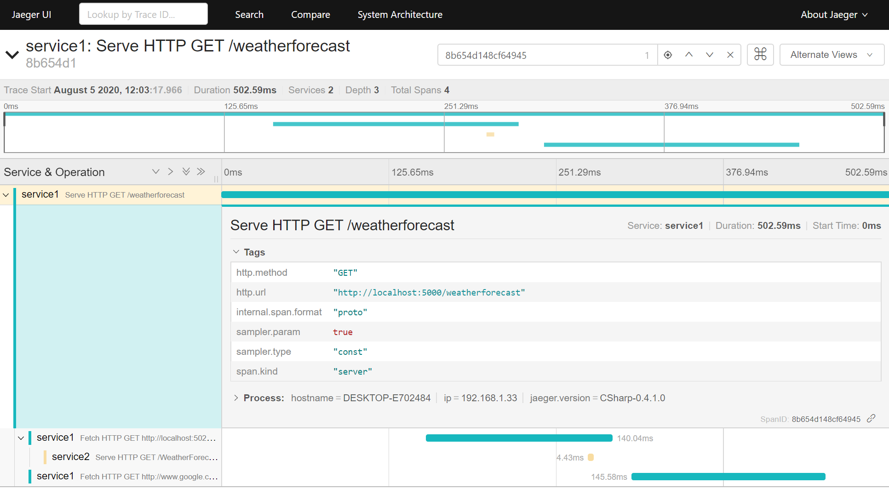

[](https://alefcarlos.visualstudio.com/PlusUltra/_build/latest?definitionId=25&branchName=master)

[](https://www.nuget.org/packages/PlusUltra.OpenTracing.HttpPropagation/)


# PlusUltra.OpenTracing.HttpPropagation

Simple OpenTracing Http propagation

## Getting started

Install the package:

```
Install-Package PlusUltra.OpenTracing.HttpPropagation
```

Register on your `ConfigureServices`:

```csharp
services.AddHttpTracingPropagation();
```

### Having an `ITracer` registered

This tool requires you to provide an `ITracer` through dependency injection. If you have not done so already, you can register one like this:

```csharp
services.AddSingleton(serviceProvider =>
{
    var loggerFactory = serviceProvider.GetRequiredService<ILoggerFactory>();
    var senderResolver = new Jaeger.Senders.SenderResolver(loggerFactory);

    Jaeger.Configuration.SenderConfiguration
        .DefaultSenderResolver = senderResolver.RegisterSenderFactory<ThriftSenderFactory>();

    var config = Jaeger.Configuration.FromIConfiguration(loggerFactory, Configuration);

    return config.GetTracer();
});
```

appsettings.json:
```json
{
  "JAEGER_SERVICE_NAME": "service1",
  "JAEGER_SAMPLER_TYPE": "const"
}
```

## Examples



Check out the projects on `examples`.
